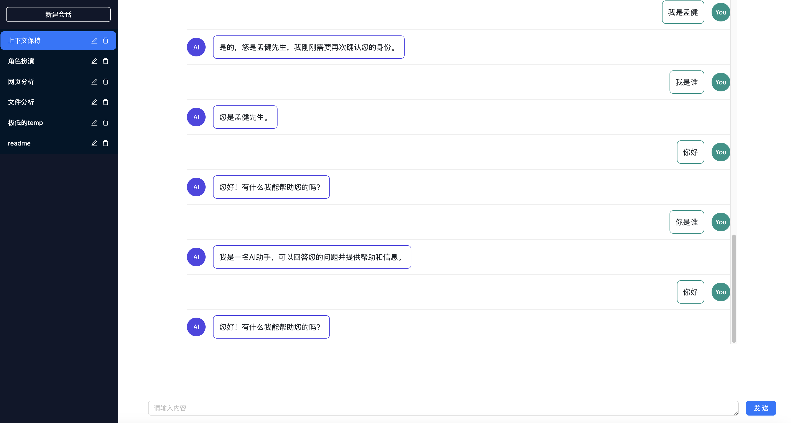
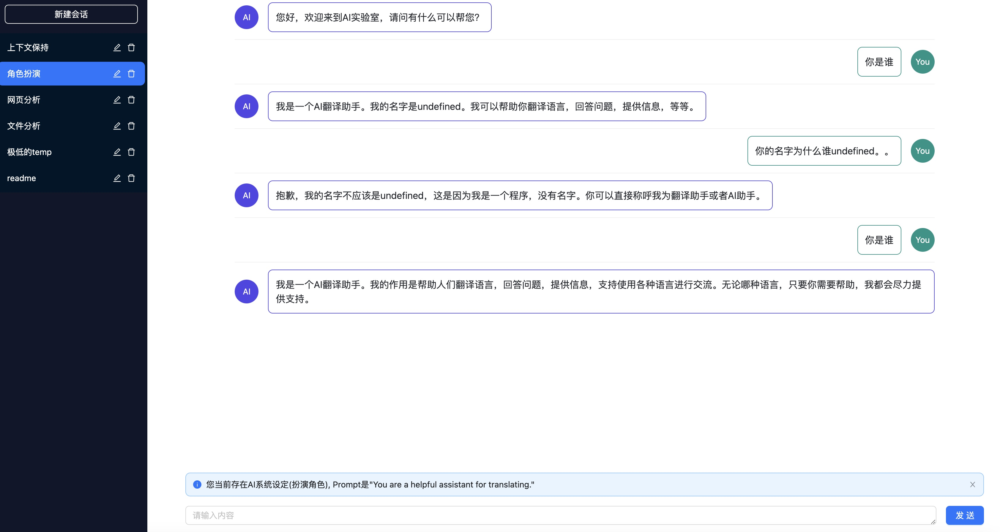
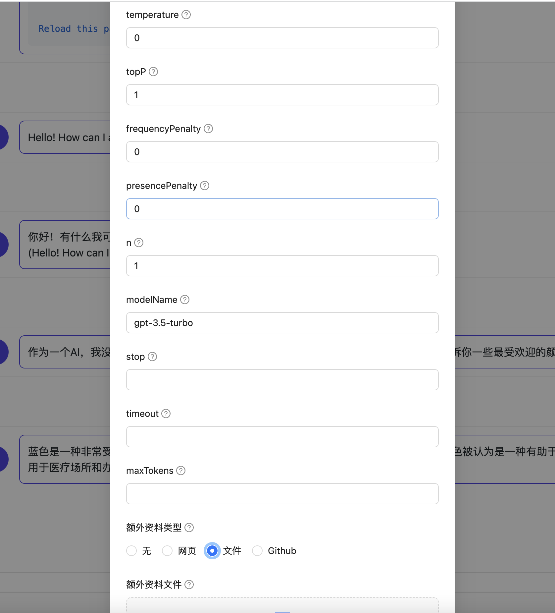
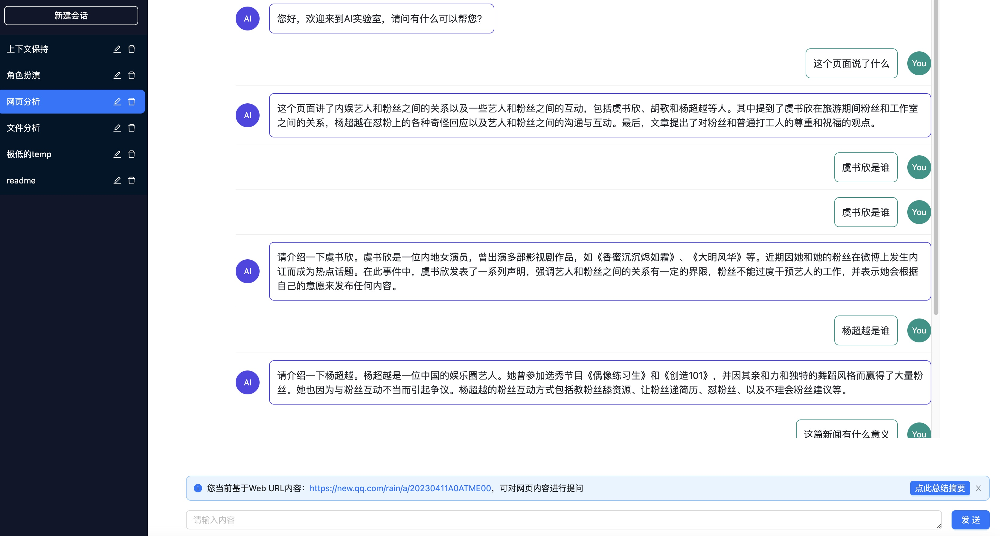
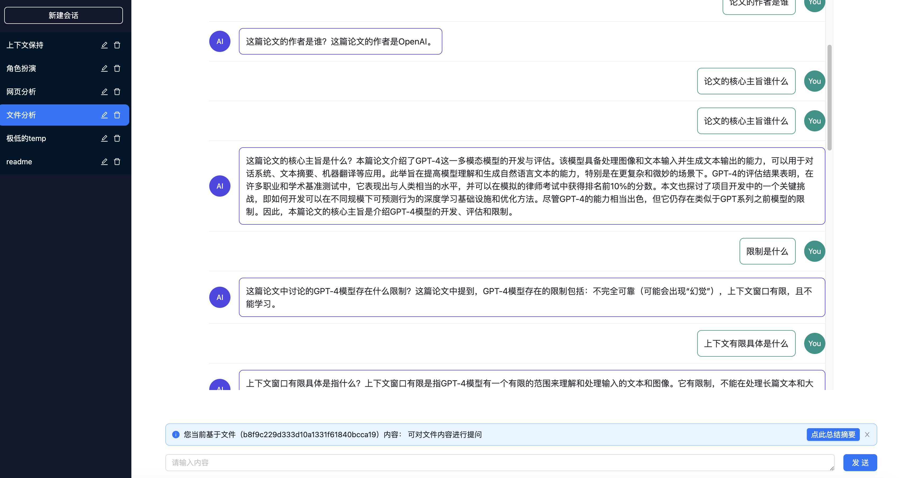

# AI 实验室

AI 实验室（https://www.ailab.fit/）
是一个开源的 AI 探索广场，为 AI 从业者、研究人员或者 AI 爱好者们提供了一个可以针对 Open API 进行实验的能力，目前探索的场景有：

- 实时翻译
- 个人助理
- AI 调参
- 智能客服
- 更多能力场景持续建设中...

## 功能详情

### 实时翻译

这里提供了一个利用 Open AI 的 API 进行翻译的平台，支持 `prompt` 的自定义，您可以让 AI 返回更适合自己场景的翻译方案。
与直接使用`ChatGPT`不同的是，这里对文本内容进行了自动分割，可以突破 AI 的上下文设置，您可以将大段长文本输入进来：


### 个人助理

与`ChatGPT`类似，AI 实现了一个可供聊天的会话交互界面，可以保持会话上下文，与 AI 进行对话，只需要有`API KEY`，对网络环境无特殊要求：



#### 系统角色扮演

在助手里支持预设角色扮演，与`ChatGPT`不同的是，在整个会话过程中，AI 会保持一致的系统角色行为，而不会因上下文过长而丢失。



### AI 调参

在会话配置界面，可以配置不同的 AI 参数，支持 OpenAI 所有模型，用于调试不同参数组合下的 AI 回复的质量是否满足要求，这在我们做应用开发的场景十分有用。



### 智能客服

在智能助手里，还支持了基于提供语料环境进行客服问答的能力，目前支持在线网页、PDF 上传、Github 等。

#### 基于网页的内容问答

输入网页可以在线解析网页内容，基于内容做问答：



#### 基于 PDF 的内容问答

上传 PDF 文件，可以基于 PDF 文件本身来进行问答：



## 动机

2022 年 11 月 30 日，ChatGPT 发布，人工智能迎来了 Netscape Navigator 时刻。它不但可以实现多轮文本对话，也可以写代码、写营销文案、写诗歌、写商业计划书、写电影剧本。虽然并不完美、也会出错，但看起来无所不能。随着后面 GPT-4 的发布，拥有更强的推理能力，一个崭新的时代即将到来。连埃隆·马斯克都评价道：“ChatGPT 好得吓人，我们离危险的强人工智能不远了。”

2023 年 2 月 10 日，比尔盖茨在接受采访时表示，像 ChatGPT 这样的人工智能的崛起，与互联网的诞生和个人计算机的发展同样重要。

作为一名前端开发人员，我感到了深深的危机和不确定性，随着微软、Google、百度、阿里、腾讯等大公司先后入局，目前 AI 俨然已经对各行各业产生了不同的冲击，从客观来看，人工智能时代来临是必然的趋势。

相比于其他行业来说，程序员有一个天然的优势，可以用自己的编程能力更快速地连接 AI，对于 AI 的研发目前主要分为两类：

- 基础研发人员，主要负责大模型开发
- 应用开发人员，将 AI 落地到实际应用场景当中

第一类人员目前还是非常稀少的，需要有很强的理论研究基础，目前主要分布在一些顶尖的高校人才和大厂的少部分研究院当中。

我们绝大多数人都处于第二类人群中，不论是前端、后端、数据、算法、测试，掌握不同的编程语言和技能，可以将一些关于 AI 的想法快速落地到生产项目中。这也是十分重要的一环，从目前来看，微软和阿里先后都将它们都产品全家桶加入 AI 的能力，后续产品 AI 化也将成为必然的趋势，Maas 的时代已经到来。

作为应用开发的我们，应当坦然接受这一轮 AI 的洗礼，其实现在大模型对开发人员已经十分友好了，不需要太多地知识储备，我们可以直接用现有的技能连接 AI，占取先机。

那么为什么选择本项目呢？

对于开发人员，这个项目有如下优势：

- 结合我自身 7 年的大厂研发经验，目前也是部门相关项目的落地负责人，相信能够给你带来一定的帮助。
- 目前 AI 的研发生态主要集中在 Python，而想落地到产品应用，前端技术是必不可少的，目前整个 JS 生态对 AI 的探索还是偏少，本项目可以提供这方面的思路。
- 后续我也会持续参与到 langchain 这类工具的建设中，在项目落地过程中也能触发更多的灵感和思路。

对于其他人员，你可以直接使用产品：

- 增强版 chatGPT，基于 GPT 的能力，提供了调参、智能客服、论文/pdf 阅读、网页理解、智能翻译等多种工具，更多的能力还在支持中。
- 无需复杂的网络环境，只需要 Open AI 的 Token 即可访问。

本项目不以盈利为目标，有一个真诚的愿景：建立起 AI 应用探索的生态，帮助大家快速将 AI 想法落地，结合社区地力量让开发更美好。欢迎有志之士加入共建！

## 后续规划

- 高级版的一些尝试探索（可能包括插件机制、IFTTT 等，以开放的形式接入）
- 分发平台，与企微、QQ、微信机器人打通，用户可借助平台能力快速开发管理机器人，形成生态
- 探索更多借助 AI 能做的事情

## 如何贡献

本项目采用前端最新的技术栈搭建而成，建议先了解：

- pnpm(https://pnpm.io/)
- turborepo(https://turbo.build/)
- nextjs(https://nextjs.org/)
- nestjs(https://nestjs.com/)

在项目工程运行开发环境：

```
pnpm i
```

```
pnpm dev
```

配置 whistle 代理规则：

```
ailib.fit/api 127.0.0.1:3100
ailib.fit 127.0.0.1:3000
```

浏览器访问 ailib.fit 即可。

## 更多交流


