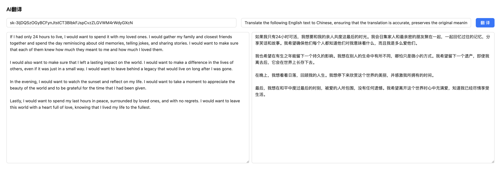

# AI 实验室

AI 实验室（https://www.ailab.fit/）是一个开源的AI探索广场，为AI从业者、研究人员或者AI爱好者们提供了一个可以针对Open API 进行实验的能力，目前探索的场景有：

- 实时翻译
- 个人助理
- AI 调参
- 智能客服
- 更多能力场景持续建设中...

## 功能详情

### 实时翻译

这里提供了一个利用 Open AI 的 API 进行翻译的平台，支持 `prompt` 的自定义，您可以让 AI 返回更适合自己场景的翻译方案。
与直接使用`ChatGPT`不同的是，这里对文本内容进行了自动分割，可以突破 AI 的上下文设置，您可以将大段长文本输入进来：

### 个人助理

与`ChatGPT`类似，AI 实现了一个可供聊天的会话交互界面，可以保持会话上下文，与 AI 进行对话，只需要有`API KEY`，对网络环境无特殊要求：

#### 系统角色扮演

在助手里支持预设角色扮演，与`ChatGPT`不同的是，在整个会话过程中，AI 会保持一致的系统角色行为，而不会因上下文过长而丢失。

### AI 调参

在会话配置界面，可以配置不同的 AI 参数，支持 OpenAI 所有模型，用于调试不同参数组合下的 AI 回复的质量是否满足要求，这在我们做应用开发的场景十分有用。

### 智能客服

在智能助手里，还支持了基于提供语料环境进行客服问答的能力，目前支持在线网页、PDF 上传、Github 等。

#### 基于网页的内容问答

输入网页可以在线解析网页内容，基于内容做问答：

#### 基于 PDF 的内容问答

上传 PDF 文件，可以基于 PDF 文件本身来进行问答：

